# Цель работы

Цель данного курса - узнать, как обеспечивается безопасность интернет-трафика, какие пароли нужно выбирать и как их хранить, познакомиться с методами защиты сообщений в мессенджерах (WhatsApp, Telegram), понять, как работают механизмы аунтефикации в электронных платежах, а также зачем нас иногда просят выбрать квадраты, где изображены светофоры.

# Выполнение

## Как работает интернет: базовые сетевые протоколы

1. Выберите протокол прикладного уровня:

Среди всех представленных TCP, UDP - протоколы транспортного уровня, а IP - сетевого. Протокол прикладного уровня здесь только один - HTTPS.

2. На каком уровне работает протокол `TCP`:

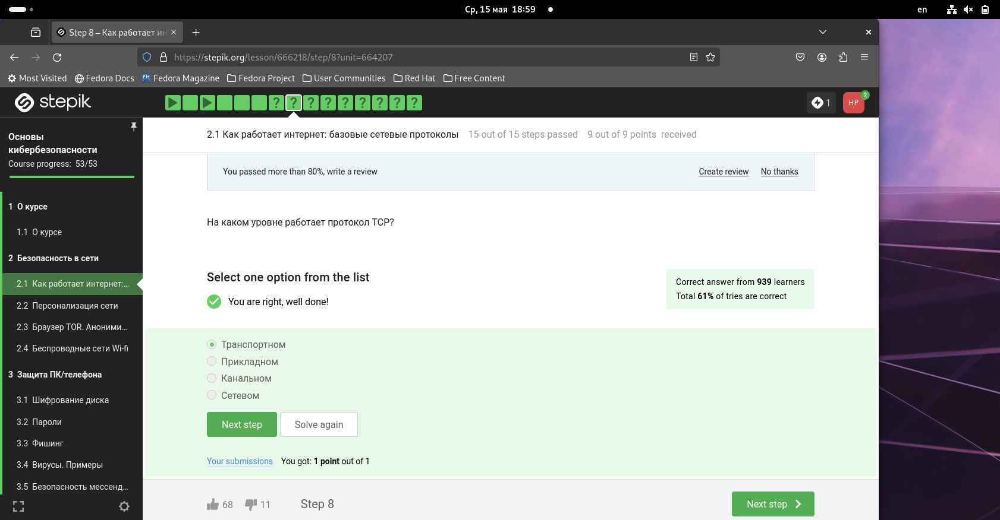

Протокол TCP работает на *транспортном* уровне.

3. Выберите все корректные адреса `IPv4`:

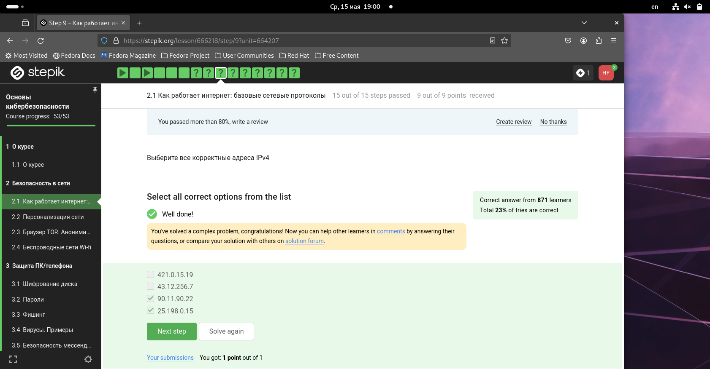

Существуют две версии адресации в протоколе IP. Популярный на сегодняшний день - это версия 4 адресации (IPv4), и этот адрес состоит из большего набора чисел, нежели порт в TCP протоколе, а именно это 4 числа от 0 до 255. Например, адрес IPv4 может выглядеть вот так: 192.168.1.4. Соответсвенно, все числа, которые >255 не подходят.

4. Что делает `DNS` сервер:

Oсновная задача DNS-сервера - это сопоставить название, то есть доменное имя, с корректным IP-адресом, с тем, где лежит этот сервер, этот сайт. Когда это сопоставление прошло (то есть я знаю, что yandex.ru находится по такому IP-адресу), дальше в сети сегмент моих данных передается по транзитным узлам или маршрутизаторам.

5. Выберите корректную последовательность протоколов модели `TCP/IP`:

В модели TCP/IP существует несколько уровней, а именно 4. На самом верхнем уровне, прикладном работают пользовательские программы, и задача прикладного уровня - обеспечить доступ для этих пользовательских программ к услугам Интернет. Все эти протоколы прикладного уровня работают над транспортным уровнем, это следующий уровень в модели TCP/IP. Транспортный уровень обеспечивает передачу данных между процессами на одной машине или хосте (host). Хост - это устройство, которое подключено к интернету. Это может быть компьютер, смартфон. И транспортный уровень отвечает за корректное распределение пакетов между программами. Транспортный уровень работает над следующим уровнем модели TCP, так называемым сетевым или межсетевым уровнем. В этом уровне принимает участие не только программа, не только наша машина, но уже наш роутер, то есть то устройство, к которому мы подключаемся, чтобы получить интернет. Сетевой уровень ответственен за передачу данных между различными физическими сетями. Сетевой уровень работает над так называемым канальным уровнем или самым низким уровнем модели TCP/IP. И в этой модели работает уже физика. Здесь происходит физическая передача данных. И здесь мы уже будем говорить о пропускной способности канала, об обеспечении помехоустойчивости, и основные примеры протоколов канального уровня непосредственно связаны с тем, как мы передаем данные.

6. Протокол `http` предполагает:

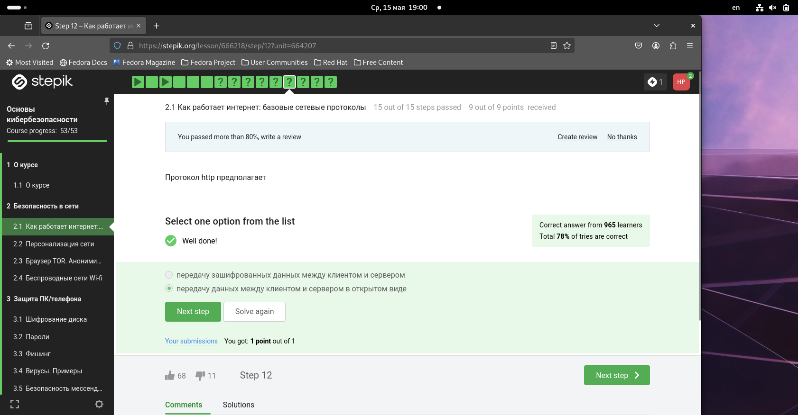

HTTP-сообщения представляют собой обычный текст, поэтому неавторизованные лица могут легко получить к ним доступ и прочитать их через Интернет. Напротив, HTTPS передает все данные в зашифрованном виде.

7. Протокол `https` состоит из:

Протокол https состоит из 2 фаз: фазы рукопожатия и фазы данных. Во время фазы рукопожатия происходит:

- выбор параметров, протоколов
- аунтефикация
- формируется общий ключ К

В то время как во время фазы передачи данных происходит непосредственно шифрование трафика с помощью ключа К.

8. Версия протокола `TLS` определяется:

Версия протокола выбирается в фазе рукопожатия при выборе параметров совместно.

9. В фазе "рукопожатия" протокола `TLS` не предусмотрено:

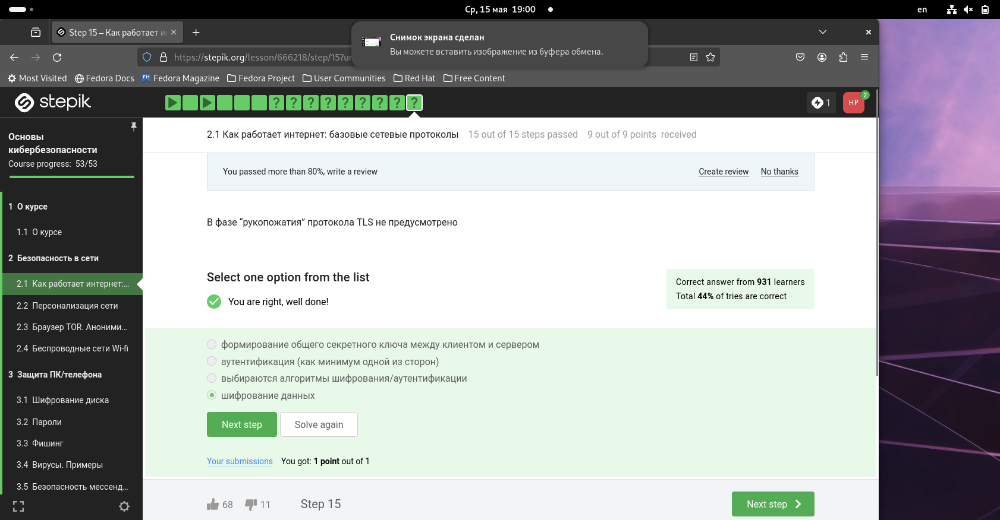

Шифрование данных происходит в фазе передачи данных.

## Персонализация сети

1. Куки хранят:

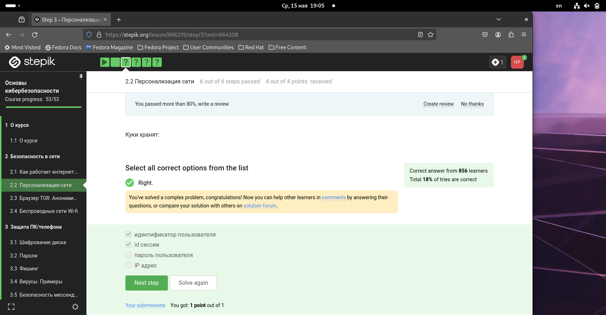

Куки, как правило, хранят в себе список параметров и их значений. Этими параметрами могут быть id пользователя, id сессии, иногда описан тип браузера и время запросов и некоторые действия пользователей. Опять же, если это интернет-магазин, то в куки может храниться то, что мы просматривали, какие страницы мы посещали. В куки никогда не хранятся пароли или хэш от паролей пользователя, куки для этого не предназначены и не должны хранить наши пароли. 

2. Куки не используются для:

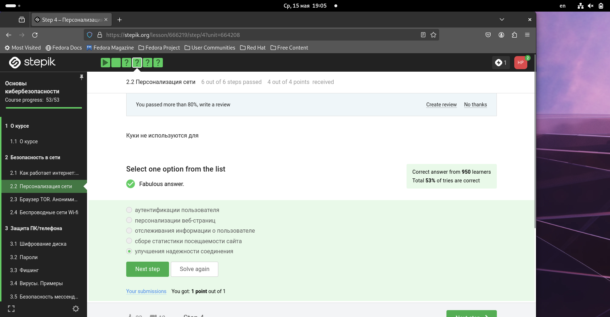

Куки - это данные, которые передаются от сервера клиенту для его идентификации. Так, например, они сохраняют сессионную информацию. Примером является тот факт, что, когда вы, например, заходите на какой-то интернет-магазин, наполняете корзину каким-то покупками, но не завершайте покупку, а закрываете эту страницу, а потом открываете её когда-нибудь снова, часто получается так, что содержимое корзины запоминается. Кроме этого, куки позволяют персонализировать страницы: например, смена языка страницы, или когда браузер спрашивает, нужно ли перевести эту страницу на русский язык. А если вы попадаете на страницу с финским языком, и вы не часто или почти никогда не смотрите страницы на финском языке, то вас спрашивают, стоит изменить язык на какой-то другой. Кроме того, куки помогают отслеживать действия пользователей в сети. Этим часто пользуются рекламщики. Тоже, наверное, кто-то из вас встречался с такой ситуацией, когда вы покупаете что-то в интернет-магазине или смотрите какой-то товар в магазине, например, лыжи. Вы купили лыжи где-то или хотели купить, смотрели на них, и потом, заходя уже на страницы абсолютно других сайтов, никак не связанных с лыжами, в рекламе, рекламных разделах страницы вы вдруг увидите эти самые лыжи по несколько раз. Это происходит потому, что на первом сайте, где вы смотрели или купили товар, вы получили от этого сайта куки, которые записали ваши пожелания себе. Для разных сайтов эти куки выглядят по-разному, как правило, они содержат сессионный токен, который часто содержит имя пользователя, ну и ещё какие-то данные, которые позволяют этому конкретному серверу авторизовать этот браузер, этого клиента в эту конкретную сессию. Всегда, когда мы обновляем нашу страницу или переходим по каким-то ссылкам, браузер отправляет полученные заранее с этого сайта при первой авторизации куки, и наш браузер ответственен за хранение и управление куки, они у вас на вашей машине лежат. Естественно, куки - это удобно. А представьте себе, если бы каждый раз при нажатии на какую-то ссылку в Сбербанк Онлайн, вы бы заново проходили их двухфакторную аутентификацию. Конечно, это было бы неудобно, и мы делаем это исключительно благодаря тому, что при самой первой аутентификации нам прислал их сервер какие-то cookie.

3. Куки генерируются:

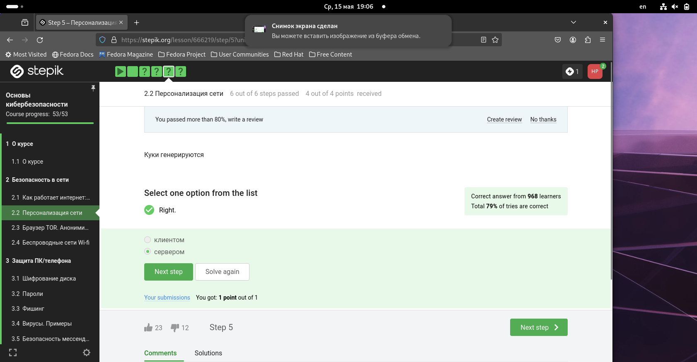

Как видно из предыдущего пояснения, куки генерируются при входе на сайт самим сервером и сохраняются на компьютере пользователя.

4. Сессионные куки хранятся в браузере:

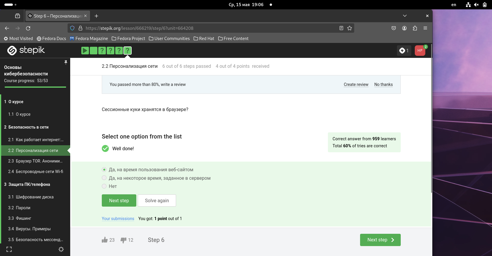

Куки бывают сессионные; как правило, эти cookies используются при навигации на сайте и удаляются при закрытии окна браузера. То есть мы закрыли какое-то окно, интернет-магазин открыли заново - корзина пуста. Это означает, что в этом сайте, на этом сервере cookies куки сессионные. Ещё они бывают постоянные, как правило, они используются при аутентификации. Постоянные cookies применяются для сбора информации, для статистики посещаемости сайта. Откуда, например, известно, сколько раз вы посетили какой-то сайт - это записывается в куках. Хотя они и называются постоянными, как правило, у всех кук есть срок жизни, и он также записан в ещё одном значении в куках. 

## Браузер TOR. Анонимизация

1. Сколько промежуточных узлов в луковой сети TOR:

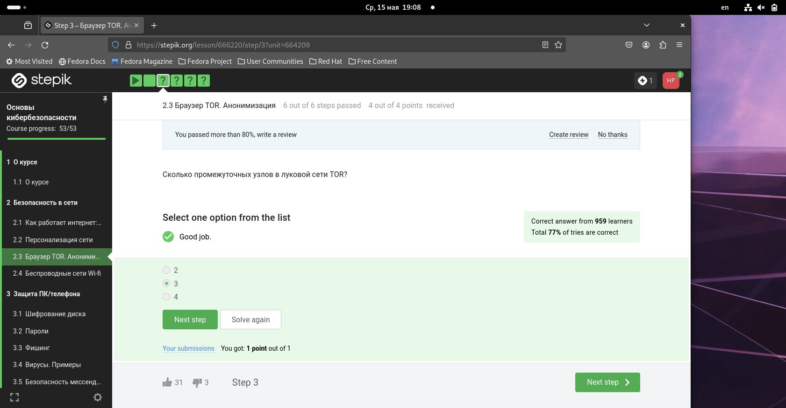

Узлы разделяются на охранный узел, промежуточный и выходной. Соответственно выходной узел, поскольку он является узлом перед получателем, знает, кому направлен пакет. Охранный узел знает, от кого пришёл пакет, поскольку он непосредственно является следующим узлом после отправителя, в то время как промежуточный узел не знает ни от кого этот пакет, ни кому он предназначен. В браузере Tor всегда есть три роутера, их не больше и не меньше. Их не меньше потому, что меньшего числа узлов не хватает для анонимизации, а большее число узлов не дает большую анонимизацию, поэтому выбирается всегда 3 луковых роутера. 

2. IP-адрес получателя известен:

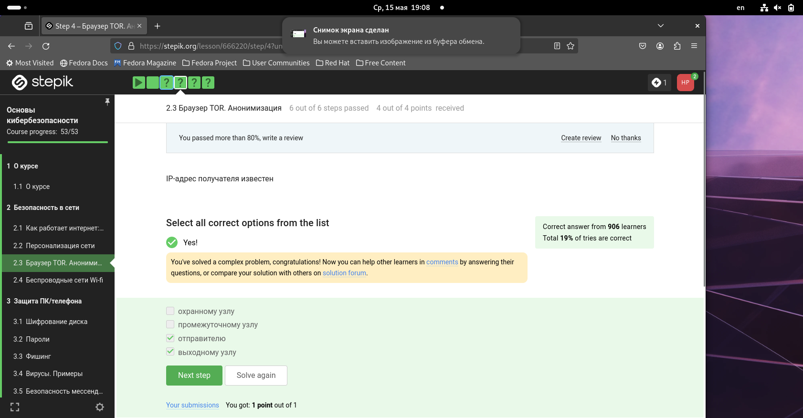

Для того, чтобы передать некий пакет данных с помощью луковой маршрутизации, отправитель шифрует пакет и ip-получателя, генерирует 3 ключа, и постепенно расшифровывая данные, получается так, что ip-получателя знает только отправитель и выходной узел, который непосредственно передает пакет данных получателю.

3. Отправитель генерирует общий секретный ключ:

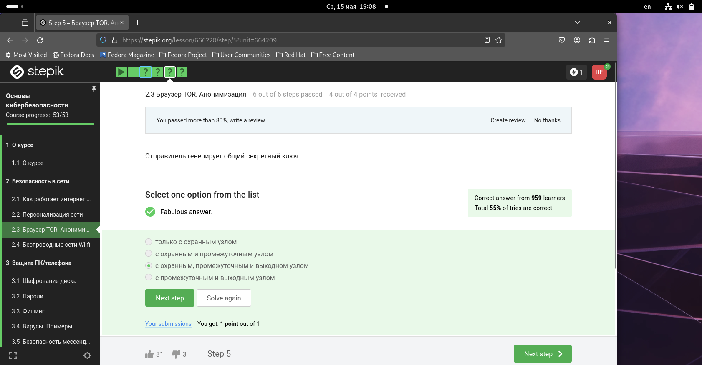

Отправитель генерирует общие ключи с тремя промежуточным узлами. Далее он шифрует свои данные под каждым из этих ключей. В начале он шифрует данные для выходного узла, сверху он шифрует зашифрованные уже данные с помощью ключа промежуточного узла, и наконец он шифрует данные с помощью ключа с охранным узлом и отправляет это тройное шифрование в сеть. 

4. Должен ли получатель использовать браузер TOR (или другой браузер, основанные на луковой маршрутизации) для успешного получения пакетов:

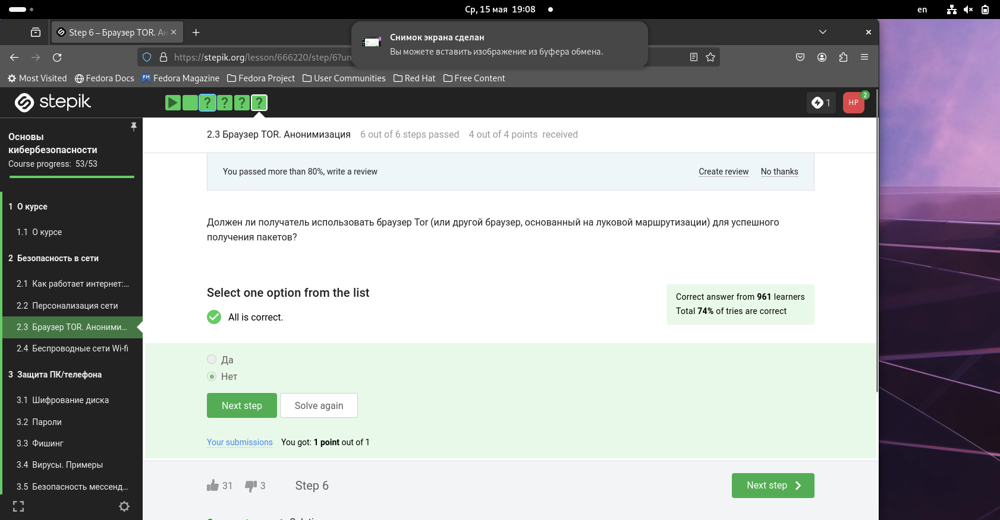

Нет, это не обязательно. Для получения пакетов использование луковой маршрутизации не обязательно.

## Беспроводные сети Wi-fi

1. Wi-fi это:

WiFi - это технология беспроводной локальной сети, она основана на стандарте IEEE 802.11. IEEE – это организация, которая описывает вообще любые стандарты того, как работает интернет. В частности, она описывает, как должен работать беспроводной интернет, и номер этого стандарта 802.11, и все последующие модификации (этот стандарт модифицируется с течением времени) носят название 802.11 и далее какие-то буквы. 

2. На каком уровне работает протокол Wi-fi:

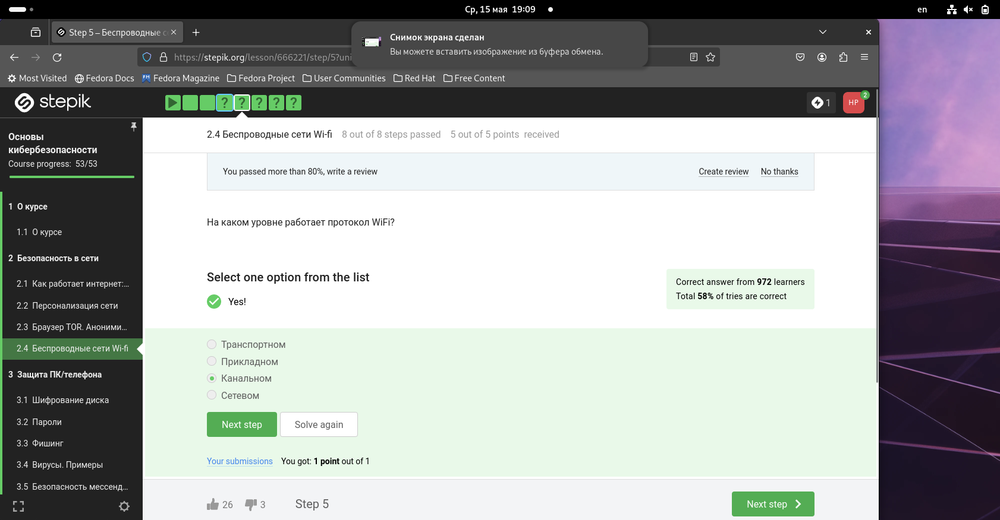

Канальный уровень (англ. Link layer) описывает способ кодирования данных для передачи пакета данных на физическом уровне (то есть специальные последовательности бит, определяющих начало и конец пакета данных, а также обеспечивающие помехоустойчивость). Ethernet, например, в полях заголовка пакета содержит указание того, какой машине или машинам в сети предназначен этот пакет. Примеры протоколов канального уровня — Ethernet, IEEE 802.11 WLAN, SLIP, Token Ring, ATM и MPLS. 

3. Небезопасный метод обеспечения шифрования и аутентификации в сети Wi-Fi:

Самый ранний и на сегодняшний день небезопасный метод шифрования данных WiFi называется WEP. Он устарел и уже категорически не рекомендуется к использованию. Он устарел, в частности, потому, что использовал малую длину ключа: так, например, он использовал длину ключа в 40 бит, это довольно мало на сегодняшний день, он может быть легко взломан. 

4. Данные между хостом сети (компьютером или смартфоном) и роутером:

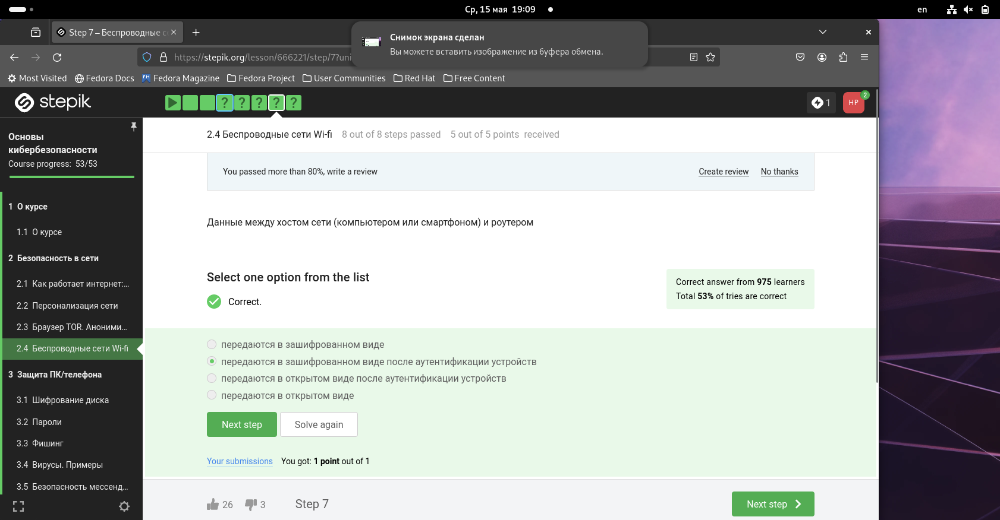

Когда мы с вами соединяемся к роутеру, мы шифруем наши данные, и до того, как начать шифрование, мы аутентифицируем себя, свое устройство этому самому роутеру.

5. Для домашней сети для аутентификации обычно используется метод:

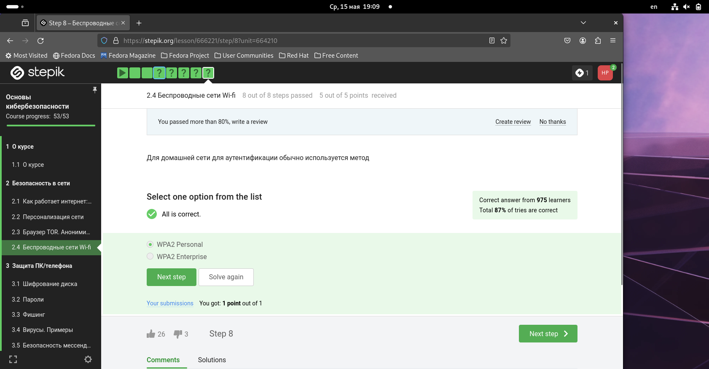

Аутентификация в современных алгоритмах WPA, WPA2 может осуществляться в двух разных режимах: WPA Personal - это классическая аутентификация по паролю, как правило, такой алгоритм используется в домашних сетях или в небольших корпоративных сетях; более сложный метод аутентификации называется WPA Enterprise - это когда у нас существует база данных всех зарегистрированных пользователей, и когда человек подключается к сети WiFi, по этой базе данных проверяется, есть ли он в базе или нет, и как правило, сама эта база данных со списком разрешенных пользователей находится на специальных серверах. Это довольно сложное устройство аутентификации, которое, скорее всего, не нужно для маленьких домашних сетей.

## Шифрование диска

1. Можно ли зашифровать загрузочный сектор диска:

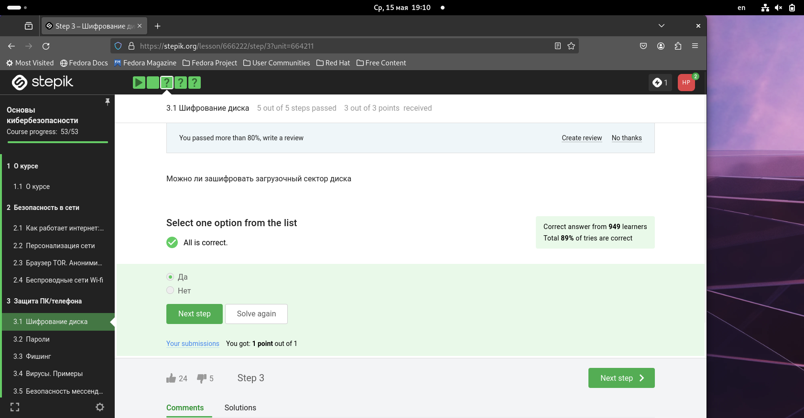

Как было сказано в лекции, шифровать можно не только жесткий диск, где мы храним файлы, можно шифровать и загрузочный сектор диска. Это тот сектор, который включается сразу после того, как мы стартовали компьютер. Компьютер считывает данные в сегменте, который хранит у себя загрузочные файлы операционной системы, и мы получаем либо свой рабочий стол, либо запрос на авторизацию для доступа к нашему рабочему столу. Вот для того, чтобы зашифровать загрузочный сектор, мы тоже можем использовать методы шифрования. В этом случае вас попросят ввести ключ или скорее даже пароль к этому ключу при самом запуске компьютера. 

2. Шифрование диска основано на:

Шифрование больших объемов данных, например, жесткого диска или сегмента жесткого диска или какой-то большой флешки, осуществляется с помощью симметричного шифрования, как правило, алгоритма AES. Это американский стандарт симметричного шифрования, он также используется для конфиденциальной передачи данных по сети. Это эффективный алгоритм, который реализован в процессорах быстро, то есть на аппаратном уровне. Благодаря тому, что это хороший алгоритм, пользователь практически не наблюдает задержек в работе, то есть данные шифруются-дешифруются быстро. Как правило, это происходит на заднем фоне, мы можем при этом работать на компьютере, будут происходить какие-то параллельные операции на шифрование и дешифрование.

3. С помощью каких программ можно зашифровать жесткий диск:

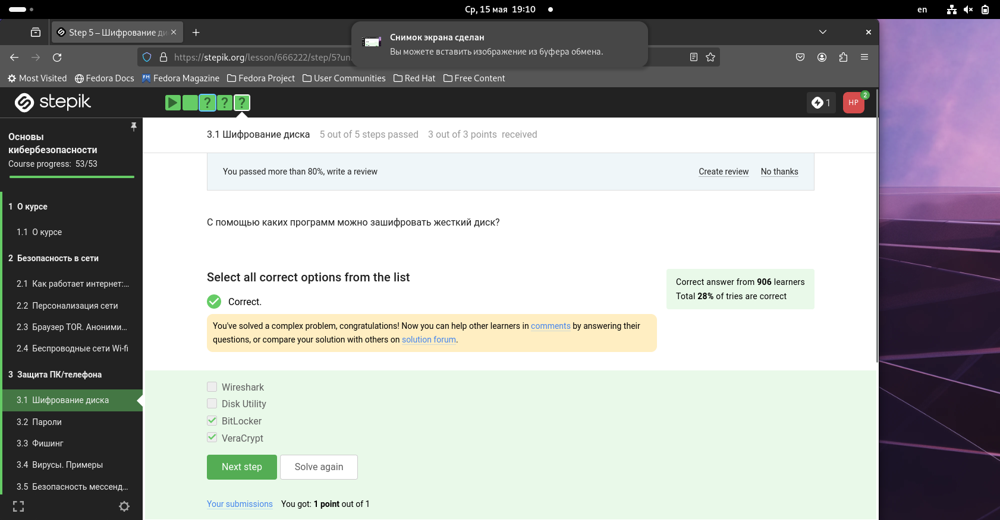

Во всех популярных операционных системах есть встроенные утилиты, которые позволяют шифровать жесткий диск: для Windows этo Bitlocker, в Linux – LUKS, в MacOS – это FileVault. Кроме того, есть и сторонние опенсорсные (open source) программы, то есть бесплатные: это Veracrypt, PGPDisk, которые вы можете установить себе и использовать их для шифрования ваших жестких дисков, загрузочных секторов или флешек.

## Пароли

1. Какие пароли можно отнести с стойкими:

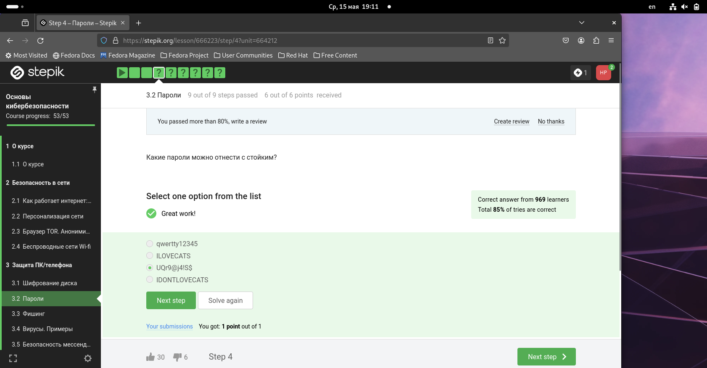

Основной критерий стойкости пароля - это сложность его перебора. Самая основная атака на наши пароли - это банальный перебор всевозможных паролей. Например, если мы возьмем пароли длины 6, которые состоят только из цифр от 0 до 9, то множество всех таких паролей будет содержать в себе 106, то есть один миллион элементов, и это множество перебирается на самом простом, недорогом ноутбуке за секунду в сегодняшних возможностях. Важно то, что, если мы будем увеличивать длину пароля, допустим, возьмем не 6, а 10, и опять рассмотрим только цифры, мы получим с вами 1010 всевозможных паролей, это 10 миллиардов паролей. Это уже больше, для этого нам потребуются более серьёзные мощности, нежели домашний лаптоп, однако это все равно вполне себе перебираемое множество, на которое мы просто потратим не секунду, а, например, часы или дни, в зависимости от оборудования. Важно то, что, если мы с вами перейдем от цифр к буквам, например, возьмём латинский алфавит, даже только нижний регистр, маленькие буквы, то мы значительно увеличим мощность всевозможных паролей длины 8. Если у нас есть 10 цифр и 26 букв алфавита, то мы получим 368 всевозможных паролей для перебора, это уже почти 3 триллиона паролей, и перебор вот такого множества уже становится практически не реализуем, для этого нужно действительно очень много машин соединить, очень большие мощности, и вот такой пароль считается уже относительно безопасным. Естественно, если мы с вами добавим в эти 8 символов еще и 8 слотов для символов и ещё спецсимволы, то мы уже увеличим с вами область перебора до числа, перебор которого на сегодняшний день невыполним. Таким образом, поэтому, когда мы создаем пароль, он всегда автоматически проверяется на стойкость. Проверяется его длина и из какого алфавита он состоит: из цифр, букв нижнего регистра, верхнего регистра и спецсимволов. Как правило, вас просят добавить как минимум один спецсимвол, как минимум одну цифру, как минимум одну букву верхнего регистра, нижнего регистра. Это все сделано для того, чтобы сложность перебора вашего пароля была большой. 

2. Где безопасно хранить пароли:

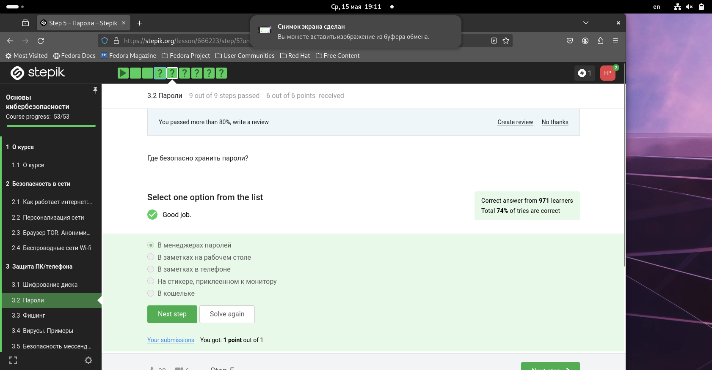

Перейдем к тому, как хранить пароли на компьютере. Мы уже договорились, что пароли должны быть длинные, длинные пароли сложно запомнить. Поэтому корректно хранить свои ключи в хранилище паролей. Хранилища у нас есть на разных операционных системах. Я привела в пример KeepassXC, по-моему, он кроссплатформенный, он есть и на Linux, на Windows; на Mac есть Keychain Access, это утилита, которая хранит пароли. И если у вас есть такое хранилище паролей, достаточно запомнить мастер-ключ, мастер-пароль от этого самого хранилища, и когда вы получите доступ к своему хранилищу, вы можете посмотреть все свои длинные безопасные пароли к разным сервисам, запоминая только один хороший пароль. 

3. Зачем нужна капча:

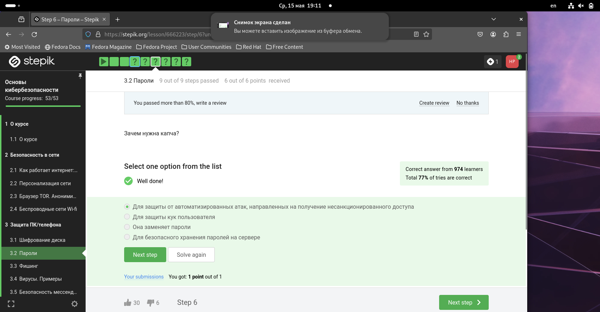

Капча - это аббревиатура с английского; это тест для определения, является ли пользователь, который общается с веб-сервисом, человеком или компьютером, ботом, которой пытается просто-напросто перебрать все пароли. После того, как мы ввели имя пользователя и пароль, часто помимо этого нас еще какой-то веб-сайт спрашивает какой-то тест, в котором мы должны там увидеть какие-то плохо написанные буквы или символы, и цель этого - отличить нас от компьютера, который пытается автоматически перебрать пароли конкретного пользователя или даже в сумме пользователя и пароля, просто пусть какой-то доступ к ресурсу. 

4. Для чего применяется хэширование паролей:

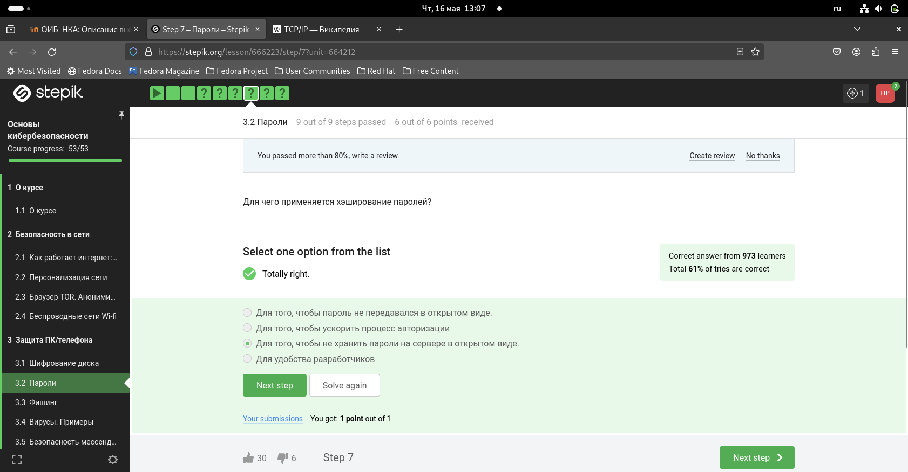

Что такое хэш? Хэш произошло от английского to hash – перемалывать, работать мясорубкой, то есть это преобразование какого-то числа информации в какую-то другую информацию. В частности, хэш-функция - эта функция, которая берет на вход любую строку битовую и преобразует ее в строку фиксированной длины, то есть она сжимает её. Есть разные типы хэш-функций, важное свойство конкретно криптографический хэш-функции заключается в том, что, во-первых, она эффективна, то есть она считается буквально за миллисекунды; во-вторых, получив на вход произвольные данные, будь то pdf-файл, будь то какой-то сектор жесткого диска, эта функция выдаст нам независимо от входа какое-то фиксированное число бит. И важное свойство этого фиксированного числа бит - выходные биты не должны никаким образом видимо зависеть от входного числа бит. Основная идея хэш-функция состоит в том, что, имея выход хэш-функции, сложно найти входные данные. Если говорить более строгим математическим языком, если мы имеем образ хэш-функции (то есть выход хэш-функции), сложно найти прообраз хэш-функции, то есть вход, который привёл к этому выходу. 

5. Поможет ли соль для улучшения стойкости паролей к атаке перебором, если злоумышленник получил доступ к серверу:

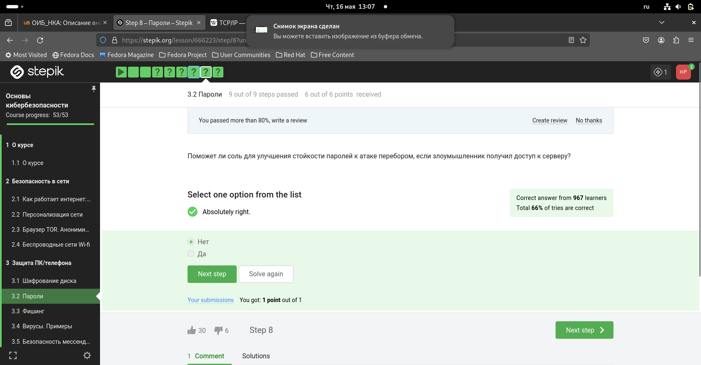

Соль используется для того, чтобы увеличить стойкость пароля для пользователей, которые сами не догадались о стойкости своих паролей. Например, если у нас alice логинится с паролем 12345, что делает при этом сервер? Сервер не хочет хранить хэш от пароля 12345, потому что, скорее всего, злоумышленник имеет таблицы с самыми популярными паролями и их хэшами. Какая функция хэш используется в конкретном сервере, все знают. В основном, много серверов используют в своих таблицах SHA2 или SHA3, и, естественно, злоумышленник может для самых частых паролей посчитать эти значения, поэтому хранить хэш от 12345 абсолютно бессмысленно, и так понятно, что это соответствует паролю 12345. Поэтому умный сервер делает следующее: он сам генерирует какой-то действительно хороший пароль или кусочек какого-то пароля, не обязательно, чтобы он был длинный, добавляет эти случайные биты к паролю и хэширует результат. Под словом добавляет я имею в виду, что он приписывает кусочек после самого пароля alice, еще это называется конкатенация строк. Соль - это и есть тот кусочек случайного бита, который генерирует сервер в своей таблице. Следовательно, при доступе злоумышленника к серверу, у него будет доступ и к соли, а следовательно и к паролю, поэтому, соль не поможет для улучшения стойкости паролей к атаке перебором.

6. Какие меры защищают от утечек данных атакой перебором:

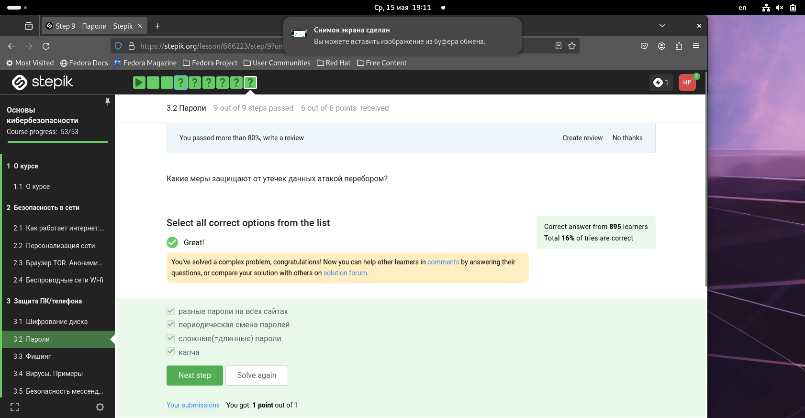

Все вышеперечисленные пункты смогут защитить аккаунт от утечки данных атакой перебором.

## Фишинг

1. Какие из следующих ссылок являются фишинговыми:

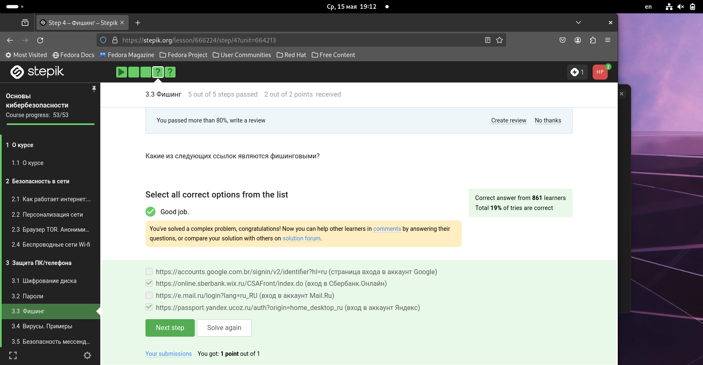

Для того, чтобы адресный фишинг сработал, чтобы вас поймали на удочку, вам необходимо всего лишь некорректно с точки зрения безопасности отреагировать на email, который содержит ссылку на какую-то фальшивую страницу. Допустим, вам пришло какое-то письмо с интересной ссылкой vk.club5.ru. Если вы зайдёте по этой ссылке, вы наверняка встретите интернет-страницу, идентичную странице известной соцсети ВКонтакте. Если вы не будете внимательными, захотите внести свои данные аутентификации в это окно и нажмёте «войти», то все ваши данные, которые вы вбили - юзернейм и пароль – естественно, при нажатии на клавишу «войти» не аутентифицируют вас в эту соцсеть, а перешлют эти данные хакеру. При этом сработает какой-то код, который сгенерирует сообщение, отправит его благополучно хакеру, вы при этом ничего не заметите. 
Другой пример фишинга - эта маскировка под известные веб-сайты только с другим доменным именем, начало может быть одинаковое или середина. В примере с vk.com понятно, на какой сервис это ссылается, ну а потом идет какая-то белиберда, которая не имеет ничего общего с реальной ссылкой. Естественно, никакие данные вводить сюда нельзя, но и более того, заметьте, что соединение вот с этим сайтом произошло не по HTTPS протоколу, а по небезопасному HTTP протоколу, это тоже звоночек, потому что с этого сайта лучше побыстрее уйти. 

2. Может ли фишинговый имейл прийти от знакомого адреса:

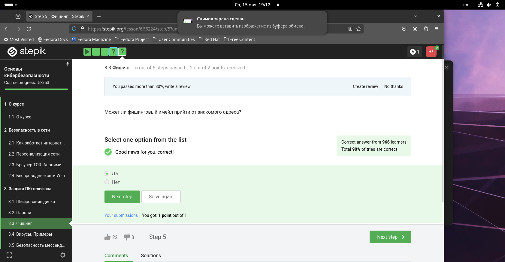

Если вернемся к адресному фишингу имейлов, возникает вопрос, можем ли мы получить вот такое фишинговое письмо от отправителя, которого мы знаем. Наверняка кто-либо из вас уже получал такой спам, и адрес отправителя оказывался адресом человек, которого вы как бы знаете, с которым общаетесь иногда. Это называется email spoofing/спуфинг от английского spoof – подменить. И спуфинг – это глобальный термин атак, есть IP spoofing - это подмена IP-адреса, есть email spoofing - подмена адреса отправителя. Суть состоит в том, что мы получаем фишинговое письмо от якобы знакомого нам человека, а на самом деле отправлено оно было не им. Это работает потому, что классический протокол отправки писем (SMTP) не включает проверку адреса отправителя, и поэтому у нас существуют вот такие надстройки на классический протокол SMTP, которые называются, например SPF (Sender Policy Framework). Это расширение протокола SMTP, которое позволяет получать письма только от некоторого списка авторизованных IP-адресов. Этим занимается, как правило, наш почтовый сервер, но и большинство почтовых серверов, которые позволяют нам регистрировать свои почтовые ящики (Google, Yandex, Mail.ru и другие крупные почтовые сервисы), конечно, позволяют это расширение подключать. Как правило, вместе с этим расширением вдогонку идет другое расширение, оно называется DMARC. Это протокол аутентификации email, он содержит правила, согласно которым сервер либо отправляет, либо блокирует письмо, и этим также заведует наш почтовый сервер. 

## Вирусы. Примеры

1. Email Спуфинг - это:

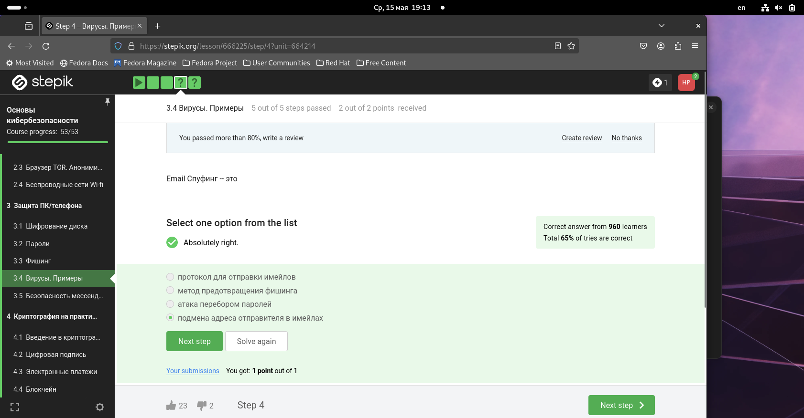

Ввиду комментария к предыдущему пункту, email спуфинг это подмена адреса отправителя.

2. Вирус-троян:

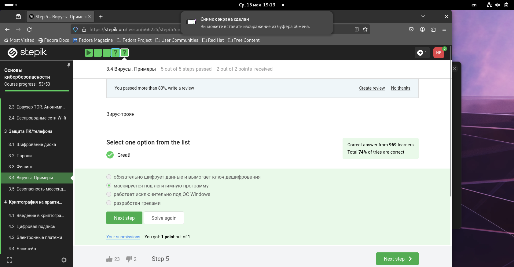

Троян - это вирус, который проникает в систему под видом какого-то легитимного программного обеспечения, это аллюзия к троянскому коню. 

## Безопасность мессендеров

1. На каком этапе формируется ключ шифрования в протоколе мессенджеров Signal:

Сквозное шифрование в протоколах Signal реализовано в двух больших шагах: это те же самые шаги, которые мы с вами уже встречали в протоколе TLS, когда говорили о безопасной коммуникации с веб-сервером. Вначале мы генерируем общий ключ, и уже после с помощью этого общего ключа отправляет сообщение уже зашифрованное под этим общим ключом Бобу. Кроме этого зашифрованного сообщения, она отправляет Бобу свой кусочек открытого ключа, при этом Боб, получив этот кусочек открытого ключа, имея какую-то свою секретную информацию, формирует тот же самый общий ключ, с помощью которого Алиса шифровала сообщение. Получив зашифрованное сообщение и вычислив общий ключ, Боб может уже дешифровать корректно это сообщение. 

2. Суть сквозного шифрования состоит в том, что:

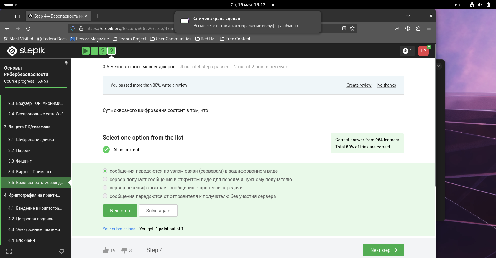

Суть довольно простая: у нас есть два участника - Алиса и Боб, A и B, и сквозное шифрование заключается в том, что сервер, который передает сообщение, который направляет сообщение от Алисы к Бобу или от Бобу к Алисе, знает только то, куда эти сообщения должны быть направлены, но сообщения он передает в зашифрованном виде, то есть он как бы работает маршрутизатором  сообщений, не зная о том, что он передает. Что происходит, если мы хотим отправить сообщение от Алисы к Бобу? Алиса шифрует свои данные, кладет на сервере шифр-текст с пометкой, что этот шифр-текст предназначен для Боба. Когда Боб заходит в сеть, сервер видит: «Ага, Боб зашел в сеть, надо обновить его сообщение», и отправляет шифр-текст от Алисы. Боб получает этот шифр-текст, дешифрует его, получает сообщение в открытом виде. При этом сервер не знает ни ключ, с помощью которого Алиса шифровала, ни тем более сообщение в открытом виде. 

## Введение в криптографию

1. В асимметричных криптографических примитивах:

Определяющее свойство симметричной криптографии состоит в том, что она включает себя протоколы, где две или более стороны имеют общие секретные ключи, поэтому она и называется симметричной. К таким протоколам относят симметричное шифрование и некоторые протоколы аутентификации. Часто симметричный протокол довольно сложно построить, сложно установить потенциальный канал связи, исключительно основываясь на симметричных протоколах, поскольку нам нужно сгенерировать общий секретный ключ, то есть либо как-то физически встретиться с другим человеком и с другим устройством, либо что-то такое сделать, чтобы мы сгенерировали общий секрет. И элегантным решением этого вопроса являются протоколы асимметричной криптографии. 

2. Криптографическая хэш-функция:

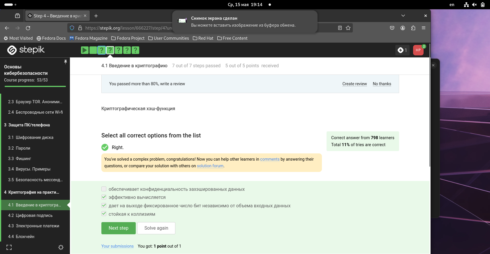

Криптографическая хэш-функция берет на вход произвольный объем данных, то есть какие-то биты и выдает на выходе фиксированную строку, например длины n. Важно, что, как правило, функция сжимает данные: она берет большой набор данных и выдаёт потом маленькое фиксированное значение. Важное свойство криптографической хэш-функций, то, что делает её криптографической – это стойкость к коллизиям. Что такое коллизия? Коллизия – это два разных входа в хэш-функцию, которые дают одинаковый выход. То есть это две разные строки например x и x’, где x ≠ x’, такие, что значения хэш-функции на них совпадают, то есть h(x) = h(x’). Это важное свойство отличает криптографическую функцию от некриптографической. Можно доказать (мы этого делать с вами не будем), что из этого свойства коллизии следует другое важное свойство, а именно то, что криптографическую хэш-функцию сложно обратить. То есть, если я вам даю какое-то значение этой функции в точке h(x) и спрашиваю вас, как найти x, то есть вход в эту функцию, для современных криптографических хэш-функций это сделать сложно.  Благодаря этим свойствам, криптографические функции широко применяются в коммуникациях, мы с вами в одной из лекций говорили о том, как криптографическую хэш-функцию можно использовать для хранения паролей. Она также используются для протоколов, подтверждающих целостность данных, ну и современное довольно популярное применение хэш-функции – это доказательство работы. По-другому это называется протоколом proof of work, который используется, например, в таком блокчейне, как биткойн. 

3. К алгоритмам цифровой подписи относятся:

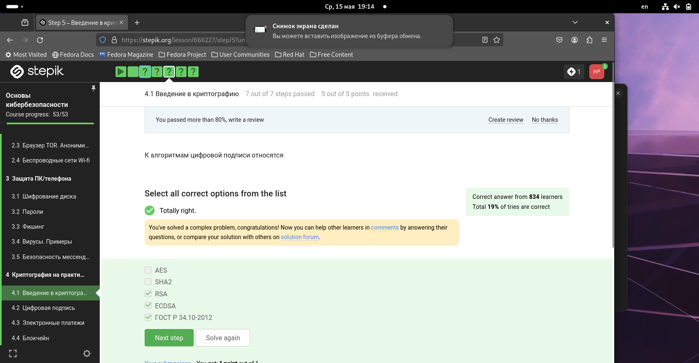

К примерам цифровой подписи относятся интернет-сертификаты, подпись RSA, американский стандарт ECDSA и отечественный стандарт ГОСТ стандарт P 34.20.2012. 

4. Код аутентификации сообщения относится к:

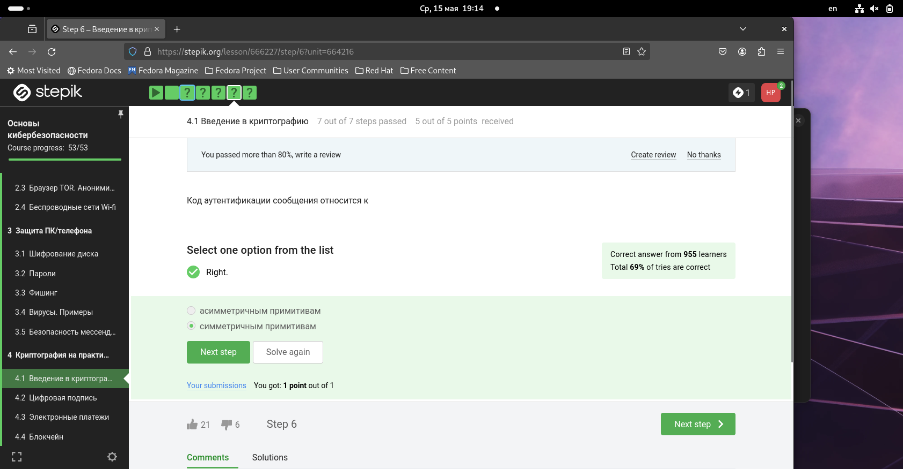

Если мы будем двигаться дальше, то симметричное шифрование можно проапгрейдить до симметричного шифрования с аутентификацией. Это означает, что к шифр-тексту, который мы сгенерировали с помощью ключа для какого-то сообщения, мы еще добавляем код аутентификации сообщения. Это также симметричный примитив, который берет на вход какой-то ключ (это должен быть другой ключ, не тот, с которого мы шифровали) и сообщение и выдает код аутентификации сообщения. Корректно об этом примитиве думать, как о симметричной версии подписи. Как правило, код аутентификации сообщения строится с помощью хэш-функции или симметричного шифрования. 

5. Обмен ключами Диффи-Хэллмана - это:

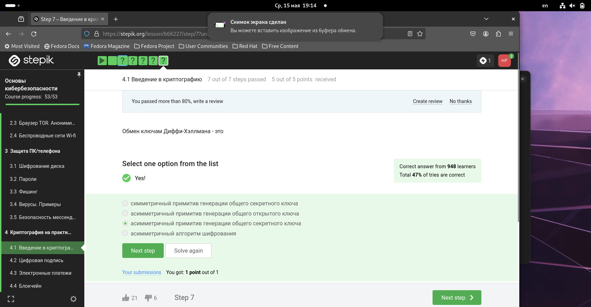

Самым популярным примером протокола обмена ключами является протокол Диффи-Хэллмана, как раз он, либо его модификации используются в современных мессенджерах и в протоколе TLS для того, чтобы мы смогли сгенерировать общий секретный ключ и дальше шифровать наши данные с помощью симметричного алгоритма, то есть с помощью ключа skAB. Если реализовать генерацию общего ключа так, как она описана у Диффи-Хэллмана, мы получим довольно слабый протокол, нестойкий к активным злоумышленникам. Сделать этот протокол стойким к активным злоумышленникам помогает цифровая подпись. 

## Цифровая подпись

1. Протокол электронной цифровой подписи относится к:

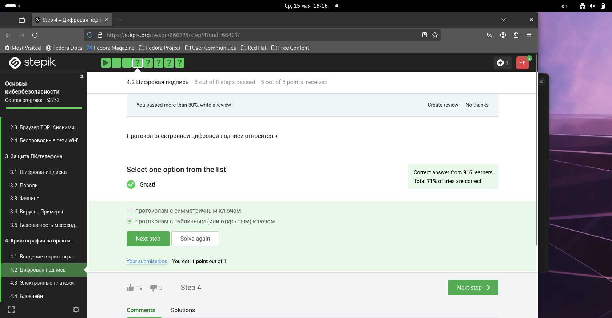

Люди, которые занимаются разработкой программного обеспечения, с выходом каждого нового обновления или с выходом самой первой версии программы обязательно подписывают программный код. Например, если вы хотите обновить свою операционную систему, допустим, Ubuntu, у организации программистов, которые выпустили обновление, есть пара ключей – это публичный ключ pkU и секретный ключ skU. Секретный ключ они держат в секрете, публичный ключ знают все. И когда они выпускают обновление, они его подписывают с помощью своего секретного ключа.

2. Алгоритм верификации электронной цифровой подписи требует на вход:

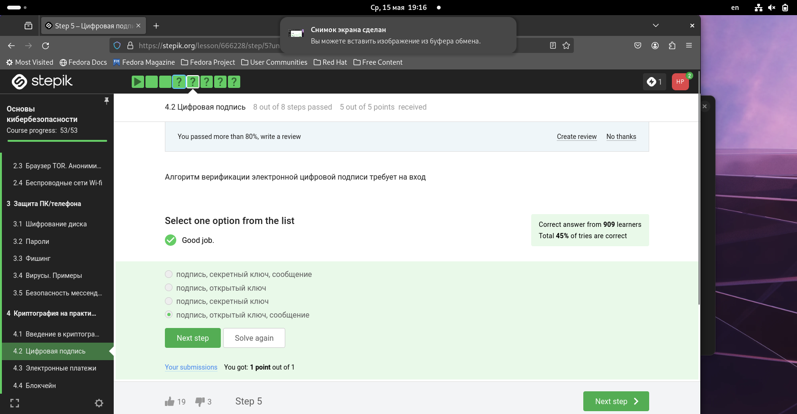

Алгоритм подписи Sign берет на вход секретный ключ и обновление, например, программный код и выдает подпись σ. Обновление вместе с подписью скачивается всеми пользователями, и, прежде чем установить это обновление, ваш компьютер проверяет, действительно ли это обновление пришло от тех программистов, от которых мы ожидаем это обновление, что это не поддельный софт. То есть каждая машина запускает процедуру Verify, которая берет на вход само обновление, подпись и открытый ключ разработчика, и в случае если верификация прошла успешно, мы можем установить это обновление. 

3. Электронная цифровая подпись не обеспечивает:

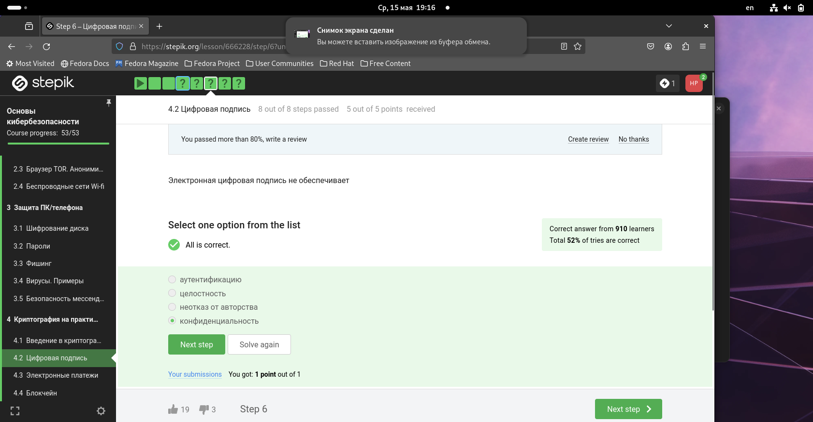

В алгоритме подготовки и верификации цифровой подписи участвуют как минимум 3 узла, поэтому, о конфиденциальности говорить сложно.

4. Какой тип сертификата электронной подписи понадобится для отправки налоговой отчетности в ФНС:

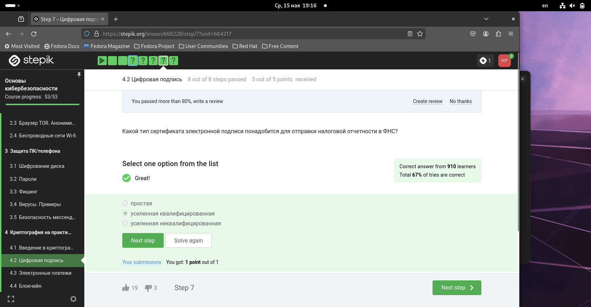

Существует три различных точки зрения на подписи: простая, усиленная неквалифицированая и усиленная квалифицированная. Первые два типа не имеет юридической силы или она довольно ограничена, но их можно сгенерировать у себя на компьютере. Простую мы генерируем с помощью пароля, PIN-кода, такая простая подпись может быть использована для авторизации на сайтах. Усиленная неквалифицированная подпись может быть подтверждена сертификатом, который вы сами же можете и выпустить, то есть кроме того, что вы выпускаете свою пару секретных ключей, вы можете сами их сертифицировать. Такая подпись может быть использована в коммерческом документообороте в небольших негосударственных структурах. А вот что касается усиленной квалифицированной подписи, эта подпись уже имеет юридическую силу, она, как правило, равнозначна рукописной. Для того, чтобы получить такую подпись, вам нужно пойти со своим паспортом и с другими данными в сертификационный центр, который должен быть аккредитован конкретным министерством. Такие подписи используются на Госуслугах, в государственном документообороте. Подробнее об этом написано в федеральном законе № 63.

## Электронные платежи

1. Выберите из списка все платежные системы:

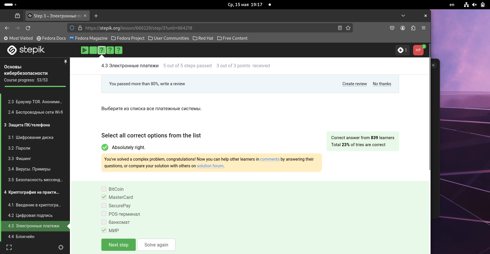

Из всех перечисленных вариантов, только MasterCard и МИР являются платежными системами. Также есть, например, VISA.

2. Примером многофакторной аутентификации является:

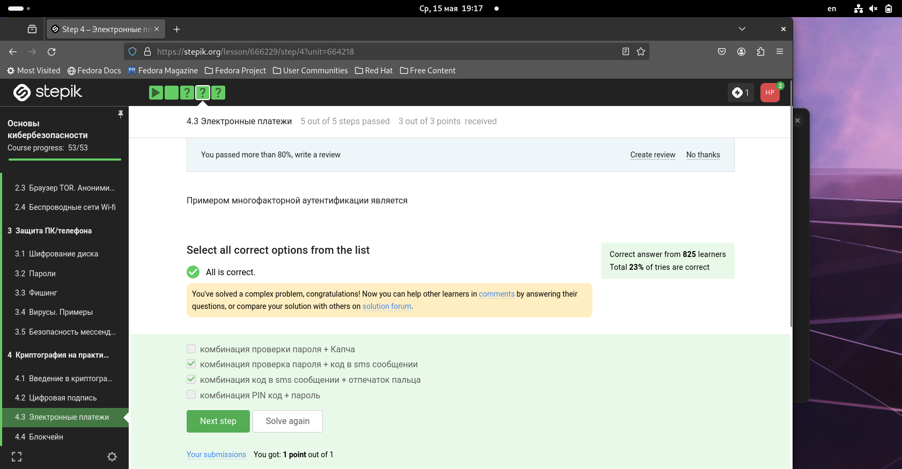

Многократная аутентификация заключается в том, что мы доказываем в ходе этого протокола несколько вещей есть. Основные категории вещей, которые мы можем доказать: 1) то, что я знаю – это либо пароль, либо PIN-код, либо в случае онлайн-платежей это секретный код, 2) конкретно в онлайн-платежах мы еще используем второй фактор – это то, чем я владею, например, телефон, именно поэтому нам часто приходит код, который вы должны подтвердить или вбить в ваш браузер, 3) другой фактор аутентификации – это свойства, например, биометрия, опечаток пальца, сетчатки глаза, 4) четвертый фактор аутентификации – локация. Способ аутентификации, как правило, выбирается банком. 

3. При онлайн платежах сегодня используется:

Сейчас однофакторная аутентификация покупателя практически не используется, так как не имеет той степени безопасности, и в многофакторной аутентификации - подтверждать, что именно вы совершаете платеж необходимо банку-эмитенту.

## Блокчейн

1. Какое свойство криптографической хэш-функции используется в доказательстве работы:

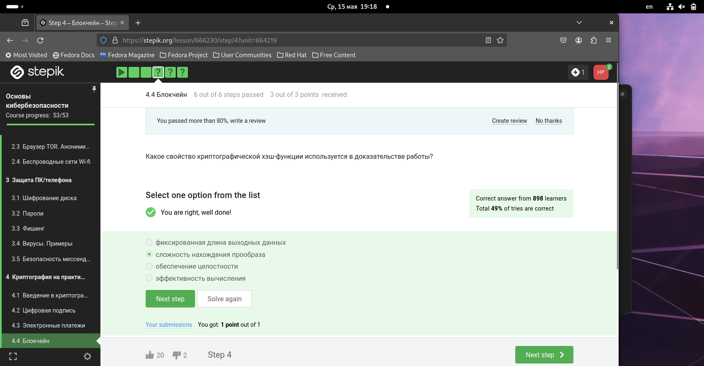

Хэш-функция - это функция, которая берет на вход любые данные и выдает за какое-то быстрое время фиксированное число бит. И задача майнера в доказательстве работы - это отыскать такой вход в хэш-функцию, что ее значение имеет определенный паттерн, иными словами, отыскать такой x, что h(x) имеет, например, 17 первых нулей или 17 первых единиц, это неважно. В биткоине используют 18 или 19 первых нулей. Это число на самом деле может быть модифицировано относительно производительности сети в тот или иной момент времени. Оно примерно находится в районе в 17-19. Почему эта задача сложная? Потому что мы знаем, что для криптографической хэш-функции неизвестно на сегодняшний день атаки быстрее, чем перебором для конкретно этой задачи. Если я вам даю какую-то хэш-функцию, например, SHA-3 или ГОСТ и прошу мне найти такой x, что h(x) содержит 17 первых нулей, и все, что вы будете делать - это перебирать разные x, смотреть на их выход и проверять, действительно ли выходное значение содержит 17 первых нулей или нет. Таким образом, ожидаемое число различных входных данных x, которое нам необходимо перебрать, пока мы не найдем нужный паттерн, примерно равно 217.

2. Консенсус в некоторых системах блокчейн обладает свойствами:

В основе любого блокчейна, в частности биткоина, лежит консенсус – соглашение, в терминах криптовалют консенсус - это некая публичная структура данных или ledger (переводится с английского как «бухгалтерская книга»), где просто содержится история всех переводов, хранится список того, кто что кому заплатил, в какое время. Почему консенсус? Потому что эта публичная структура, и бухгалтерский учет должен обеспечивать четыре основных свойства. Первое - это постоянство, то есть когда-либо добавленНые данные не должны быть удалены из этой структуры. Второе - это сам консенсус, то есть все участники видят одни и те же данные и соглашаются с одним и теми же данными, исключением могут быть последние пары блоков, то есть последние изменения в этом блокчейне, в этой публичной структуре данных. Третье - это живучесть, это означает, что мы можем добавлять новые транзакции, когда хотим, мы можем осуществлять платежи, когда хотим. И последнее четвертое свойство - это открытость, то есть любой человек может быть участником блокчейна. Это справедливо не для всех блокчейнов, для биткоина это справедливо. 

3. Секретные ключи какого криптографического примитива хранят участники блокчейна:

Допустим, у нас вами есть в блокчейне 3 участника, которые обмениваются друг с другом транзакциями. Важно то, что у каждого участника есть свой секретный ключ, и своим секретным ключом мы всегда будем подтверждать какую-то транзакцию. Важно то, что этот ключ у нас секретный, мы его используем для подписи. Подпись – это и есть подтверждение моей транзакции. Мы с вами разбирали в одной из лекций, как работает электронная цифровая подпись, у этого примитива есть секретный и открытый ключи, и наш секретный ключ - это то, что позволяет нам совершать транзакции от нашего лица. То есть, если мы говорим, что мы в транзакции переводим 10 единиц денег какому-то человеку и подписываем эту транзакцию, это не может сделать никто, кроме нас, поскольку у нас есть секретный ключ. Допустим, у нас есть три участника сети, которые осуществили 3 какие-то транзакции и подписали их: первый со своим секретным ключом, второй - со своим и третий – со своим. Эти три транзакции формируются в один блок. Этот блок должен быть каким-то образом добавлен в сеть блокчейн. Кто из майнеров будет добавлять этот блок, решает как раз таки протокол консенсуса. Допустим, протокол выбрал верхнего майнера (мы далее поговорим, что это за протокол и что майнер должен сделать для того, чтобы быть выбранным), этот майнер формирует из трех транзакций блок, проверяет, что все там корректно, и добавляет этот блок в сеть. За это он получает награду: как только он совершил какую-то работу, то есть добавил блок в блокчейн, он получает некую награду за майнинг, состоящую из тех денег, которые добавляют вот эти три участника, которые инициировали транзакции.

# Выводы

В ходе работы мы изучили, как работают интернет протоколы, что такое персонализация сети, как работает анонимизирование в интернете, что такое луковая маршрутизация и как работают беспроводные сети Wi-fi, что такое шифрование диска и как оно происходит, какой пароль лучше поставить и как обезопасить себя от утечки данных атакой перебором, что такое фишинг и спуфинг, а также изучили безопасность в мессенджерах, что такое криптография, цифровая подпись, как происходят электронные платежи и что такое блокчейн.

